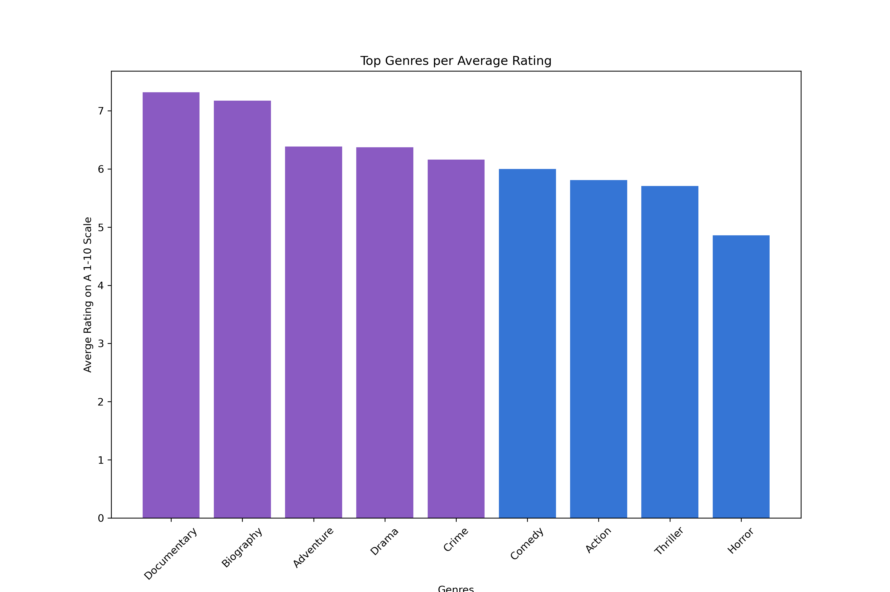
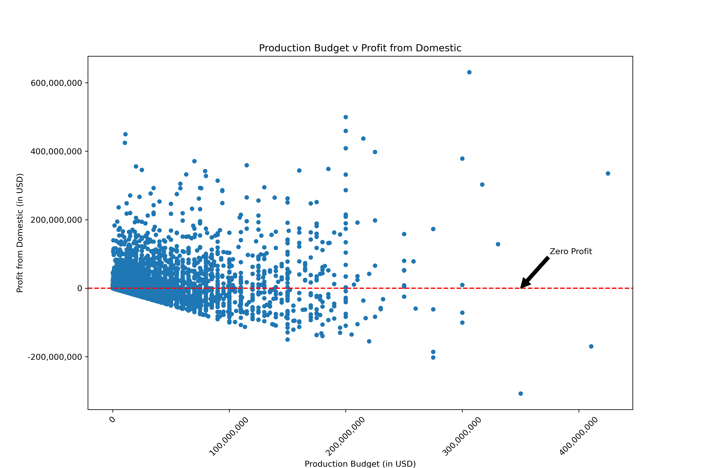
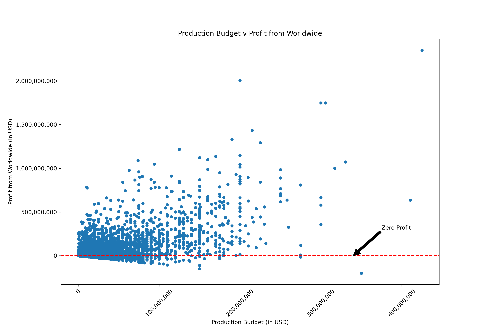
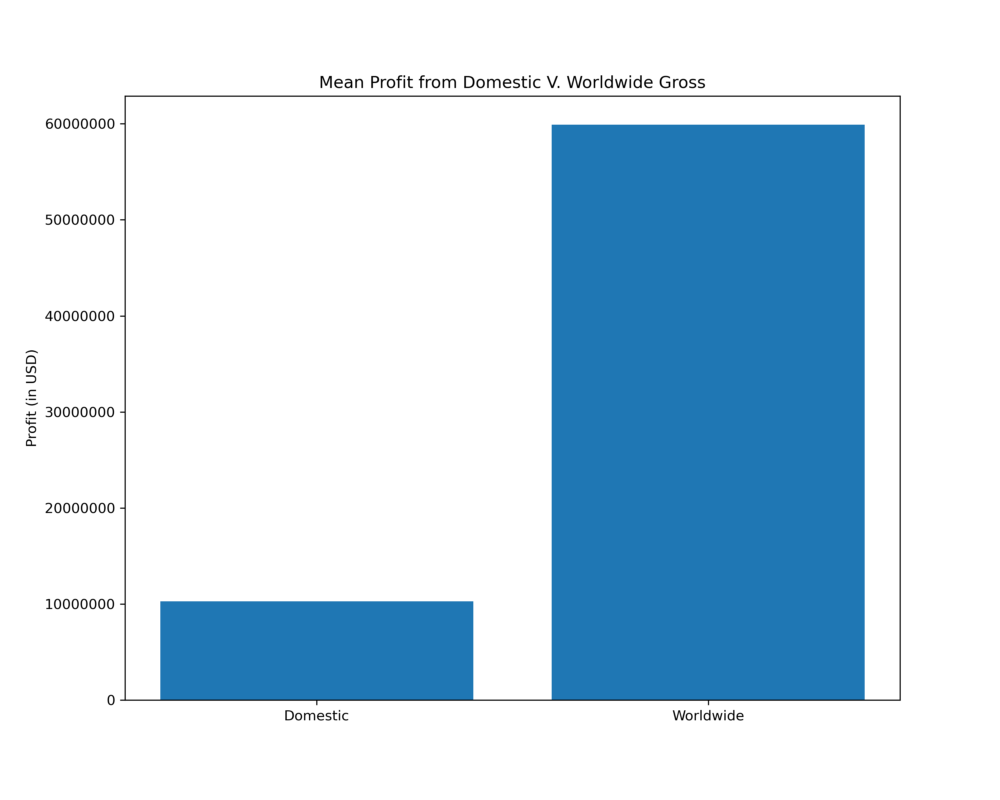
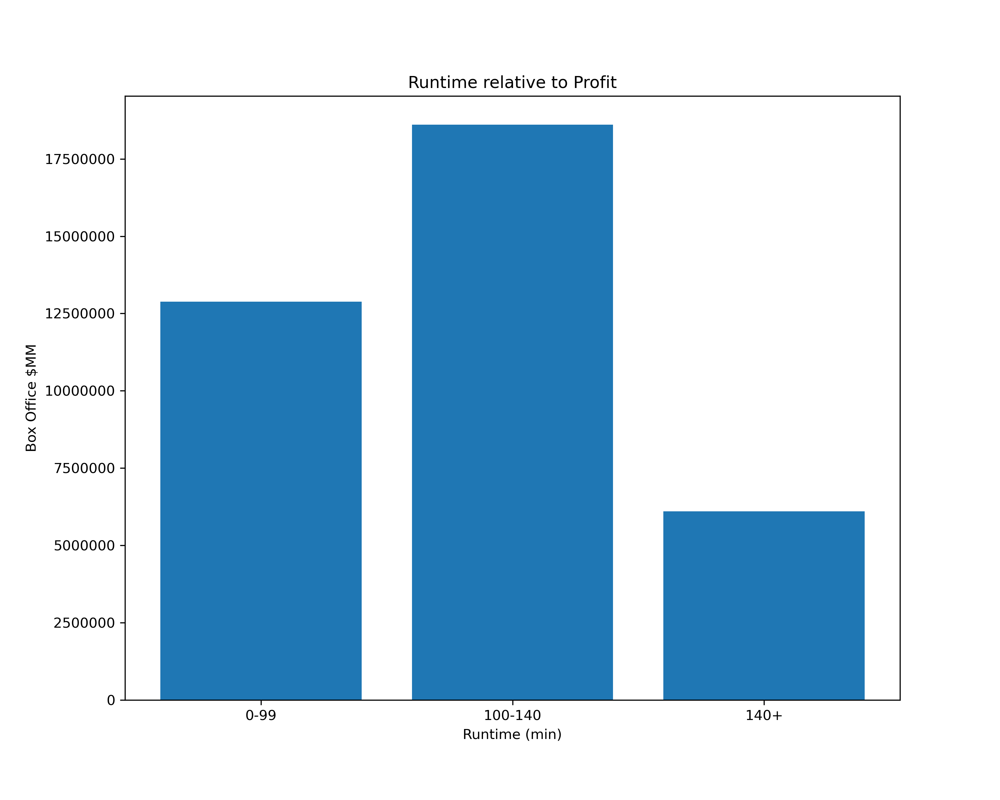

# Microsoft Movie Studio

## Overview
For this project, we are using exploratory data analysis to generate insights from different sources and past movies data for a business stakeholder.

## Business Problem
Microsoft has decided to create a new movie studio, is requesting recommendations for their product. We are tasked with exploring data on the market and translate those findings into actionable insights that the head of Microsoft's new movie studio can use to help decide what type of films to create.

## Data
To answer the business questions, we utilized various data sets including the IMBD Database and then selected the following that have relevant factors such as ratings and genres of past movies to guide our insights and recommendations. We also used TheNumbers for profit analysis and Rotten Tomatoes datasets for the best movie runtimes.

## Results
The top rated genres out of all the categories are documentaries, biographies, adventure, drama and crime. The last four are comedy, action, thriller, and horror.

There is a better profit margin in international markets than just domestic markets in the USA. There is a better chance of a return on investment as there are fewer movies that had zero profit in the international markets than in the domestic market. 

The mean between the profit in the domestic market and the international market was also displayed and it showed about a $50 million dollar difference in profit.

The movie runtime should be between 100-140 minutes as it made the most profit relative to its runtime. Anything below 99 minutes had a less profit and anything above 140 minutes had the worst amount of profit.

## Conclusions
Based on the information in the data sets, we can see the highest rated genres are Documentary, Biography, Adventure, Drama, Crime, Comedy, Action, Thriller and Horror. We recommend venturing into those fields as we explore what types of movies to make at Microsof's new studio.

In order to breakout into the movie scene by creating a new movie studio, Microsoft must expand into foreign markets as well as there is a better profit margin in international markets than just domestically in the United States.There is about a $50 million dollar difference in mean profit between international movies than just domestic movies alone.On top of that, the highest grossing movies with the most profit are franchise movies such as "Marvel Studios", "The Fast & The Furious Saga", "The Star Wars Saga", & "The Harry Potter Movies". It is imperative for Microsoft to start a movie studio based on a franchise that movie fans can really get behind.

Based on the above analysis the movies that have made the most profit are not very long nor are they very short. Most successfull movies at box office have runtime between 100-140 minutes.

## Next Steps
This dataset looks at movie information from 2010-2019. As seen on the graph, some genres that have been popular in the last few years such as Action and Comedy are on the lower end of the spectrum and is worth considering other measures in addition to genre to determine not just volume, but the profits involved in those genres. Profit, ROI or gross were not included in this dataset.

## For More Information
See the full analysis in the [Jupyter Notebook](./MIcrosoft_Movie_Studio_Analysis.ipynb).
